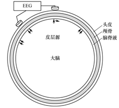

# 填空题

1. 脑机接口可以用于改善并治疗大脑功能，基于 EEG 的脑机接口治疗用途有 减少癫痫发作频率、治疗注意力缺陷症并改进认知加工、改善运动功能的恢复。
2. 目前，正在使用两种运动辅助设备：功能性电刺激、机器人。
3. BCI 应用于一般人群时，用户应用可能性很大程度上取决于 BCI 的便利性、控制能力、一致性方面的大幅改善。
4. 1978 年 Belmont 报告中（保护人类被试的国家委员会）阐述的三项原则：行善、对人尊重、公正，讨论对人的脑 - 机接口研究引发的伦理道德问题，该报告是现代人类研究标准的创始文件。
5. BCIs 把中枢神经系统的活动转化为新的输出，新的输出可以替代、恢复、增强、补充、改善自然的中枢神经系统输出。
6. EEG 电极分为主动电极和被动电极，其中被动电极直接与放大器连接，主动电极包含一个 1~10 倍的前置放大。
7. 除抗混淆滤波器，放大系统也包含由电阻器、电容器构成的模拟滤波器，把信号频率内容限制在一个特定的频率范围，这些模拟滤波器称为 RC 滤波器，RC 滤波器分为低通滤波器、高通滤波器、带通滤波器和陷波滤波器。
8. BCI 研究人员和相关的开发人员在使用 BCI 控制 AT 应用时可以有两种选择方式：同步控制和异步控制。
9. 对硬件采集到的脑电信号进行分析并产生实时输出的是决定和协调实际运行的 BCI 软件，BCI 软件包含四个关键部件：信号处理模块、特征提取模块、特征分类模块和控制接口模块。
10. 在头皮的两个电极之间测量电极阻抗的方式分为：单极模式，测量信号电极和参考电极之间的阻抗；双极模式，测量两个信号电极之间的阻抗。
11. 在大脑皮层中，和运动、感觉相关的区域主要有初级运动皮层、运动前区皮层、初级躯体感觉皮层、后顶叶皮层、前额叶皮层。
12. 脑内偶极子电流源在脑、脑脊液、颅骨和头皮上扩散的方式称为容积传导效应。
13. 脑电图（Electroencephalogram，EEG）一般的记录方式为双极性（单极性/双极性），准确记录和解读脑电图的关键是参考电极的选择。
14. 四种主要代谢神经成像方法有功能经颅多普勒、正电子发射断层扫描、功能近红外光谱、功能核磁共振成像。
15. 大脑皮层一般可分为额叶、颞叶、顶叶、枕叶四个区域。
16. 覆盖在大脑半球表面的一种厚度为 1.5~4mm 的大脑结构称为皮层，由于集中了大量神经元，故俗称为灰质，是 BCI 研究的主要脑区。
17. 大脑皮层主要有两种细胞，一种是锥体细胞，是一群投射神经元，将信息从纹状体传递至新皮质从而引发或阻止运动；另一种是星形细胞，它具有大量的树突，这些树突从胞体处开始沿着轴突终止于皮层的一个限定的区域，主要涉及局部的信息处理。
18. 离开皮层的神经纤维称之为皮层传出纤维，为许多大脑皮层到其他大脑区域提供了大量的投射；由皮层纤维形成并延续到脊髓的延髓椎体形成皮层脊髓束，其大部分投射到了中间区并且通过脊髓中间神经元间接影响运动神经元。
19. 电流源在脑、脑脊液、颅骨和头皮上扩散的现象称为容积传导，由组织的几何形状和电阻率决定。  

20. 上图中，小箭头为皮层介观源，这些源电流大部分留在颅骨内被记录为皮层脑电图（ECoG），较少部分会到达头皮被记录为头皮脑电图（EEG）。
21. 普遍的观点是，头皮记录脑电图的主要来源是大脑皮层脑回冠的同步源，脑磁图（MEG）往往对在脑沟壁的切向偶极子源更敏感。
22. 在大脑成像中，空间分辨率为 1mm 代表每个体积像素大小沿着每个方向都是 1mm，时间分辨率反映了进行一次测量所用的时间。
23. BCI 神经接口可分为头皮脑电电极阵列、皮质电信号电极阵列、植入式微电极阵列三类。
24. EEG 信号是一种无创式的脑电采集方式，其中脑电电极可以分为干电极和湿电极两种。
25. EEG 信号中的生理性伪迹主要有肌电信号 或 EMG、眼电信号（EOG）和心电信号（ECG）。
26. EEG和MEG在皮质活动灵敏性方面是互相补充的。
27. 信号处理中，按幅频响应划分的四类常用的数字滤波器为低通滤波器、高通滤波器、带阻滤波器、带通滤波器。
28. 在任何一个 BCI 中，信号处理的两个部分特征提取和特征翻译都必须一起良好地工作。
29. 完全 LIS、典型 LIS 和不完全 LIS 是很多病症或事件的结果，包括脑中风、肌肉萎缩性侧索硬化症 (Amyotrophic Lateral Sclerosis，ALS)、创伤、肿瘤、病毒性感染、或严重的大脑性麻痹。
30. BCI 被集成在某个应用中，从而一起构成独立的提供特定功能的设备被称为BCI/AT 设备或系统。
31. 一个逻辑上的 BCI 潜在用户群由不能产生任何自愿肌肉激活和完全闭锁综合征的人组成（虽然有足够的认知功能，但是无法激活任何肌肉）。
32. 诱发 P300 事件相关电位 (P300) 的特定实验范式称为Oddball 范式。
33. 采用矩阵格式的基于 P300 的 BCI 系统，其性能在一定程度上可能取决于用户注视目标时的专注程度。
34. 除抗混淆滤波器以外，放大系统也包含由电阻器、电容器构成的模拟滤波器，把信号频率内容限制在一个特定的频率范围，这些模拟滤波器称为 RC 滤波器，RC 滤波器分为低通滤波器、高通滤波器、带通滤波器和陷波滤波器。
35. 采集到的信号可以被生理伪迹(如 EMG 活动、ECG 活动、EOG 活动)、电极或连接器伪迹(如电极振动、运动电势、DC 偏置)、电磁干扰(如与电力线的电容或电感耦合) 以及放大和数字化过程中固有的噪声所污染。
36. 异步协议区分无控制状态和意图控制状态。这种操作模式允许用户在任何想要的时刻使用 BCI，异步协议可以在用户和 BCI 之间获得更加自然和动态的交互。
37. 在过程控制协议中，信号特征被转化为产生过程下一步动作的指令，(如光标或轮椅的运动，连续打开或关闭机器人手，改变神经假肢的握力等)。
38. 特定皮层系统的功能由丘脑皮层振荡开始或停止，丘脑皮层振荡用μ/β节律表达。
39. 与 EEG 比较，ECoG 具有更宽的带宽，为0-500Hz。
40. 对 BCI 研发具有最直接益处的两种测量大脑代谢活动方法分别为：功能近红外光谱、功能性磁共振成像。
41. 闭锁综合征通过症状可以分为三个阶段：完全的 LIS，经典的 LIS，不完全的 LIS（顺序可换）。
42. 目前的 BCIs 主要是同步的，即是 BCIs 而不是用户决定何时产生输出。理想的情况是，BCIs 应该是异步的（即自定节奏），并且用户的大脑信号仅当产生 BCI 输出时才进行控制。
43. 为了实现真正实用的、有效的 BCIs，我们必须解决领域里三个关键的问题，其中最困难的问题是：BCI 的可靠性。
44. BCI 系统可能被用来增强神经肌肉的性能，使其超越常规可能的性能。例如，BCI 检测特定于目标刺激的脑电特征，增加检测任务的速度和准确性。
45. 微电极暴露在外的记录区域尺度很小，微电极具有很高的阻抗，一般为几百千欧到几兆欧。因此，信号通常在传输给主放大器之前由一个距离电极较近的前置放大器放大，这可以降低信号的环境噪声。
46. 对于记录动作电位（尖峰）而言，信号质量通常用信噪比进行描述。
47. 顶叶皮层由初级体感皮层和后顶叶皮层部分组成。
48. 运动前区由额叶眼区、腹侧运动前皮层和背侧运动前区部分组成。
49. BCI 研发最常用的两种测量大脑代谢活动的方法为功能近红外光谱、功能性磁共振成像。
50. 用于 fNIRS 的光谱主要包括连续波光谱、时间分辨光谱、频域谱。
51. 列举两个 fMRI 常用的单变量信号分析发方法相关分析、广义线性模型。
52. BCI 技术为运动障碍患者带来福音，受损的功能包括交流受损、移动性受损、和自主神经功能受损。
53. 中风康复常用的方法有物理疗法、职业治疗、言语与语言治疗、BCI(任选三个回答)。
54. BCI 神经接口按植入位置可分为头皮脑电电极阵列、皮质电信号电极阵列、植入式微电极阵列三类。
55. 信号处理中常用的数字滤波器有：低通滤波器、高通滤波器、带通滤波器、带阻滤波器。
56. 预处理是提高脑电信号分类算法性能的重要步骤，常见的预处理方法包括：频率范围前置滤波；信号抽取和归一化；空间滤波；去除环境干扰和生理伪迹。
57. 脑机接口中常用的特征类型有：时域特征、频域特征、小波分析、相似性特征。
58. 分析感觉运动皮层活动的主要方法有：频率分析和空间分析。
59. 慢皮层电位是一种事件相关电位，通常包括负电位变化，该变化先于实际的或想象的运动和认知任务 (如心算)，被认为是代表准备行动的皮层激活，慢皮层电位之后通常是一个双向波，称为运动相关电位。
60. 感觉运动节律 (SMR) 是指在感觉运动皮层记录的电场或磁场的振荡，SMR 会随运动行为而变化，在运动行为期间 SMR 下降称为事件相关去同步现象，在运动行为期间 SMR 增加称为事件相关同步现象。
61. 根据电极放置位置可将 BCI 分为：非侵入式 BCI 和侵入式 BCI，不同于非侵入 BCI 只能记录场电位，侵入式 BCI 可以从细胞外空间同时记录两类信号动作电位 (尖峰脉冲)和场电位。
62. 皮层脑电 (ECoG) 可能提供高于 EEG 的性能，并且需要更少的训练，这个优势可能主要是由于 ECoG 能够记录高频 (γ) 活动，而 EEG 中却无法得到。
63. 在基于脑电信号的运动想象脑机接口系统中，常用来表征运动想象状态的脑电节律是μ波（8–13 Hz）和β波（13–30 Hz）频段的事件相关去同步/同步（ERD/ERS）现象。
64. 在 EEG 信号中，α波（8-13Hz）主要出现在大脑的枕叶区域。
65. 多模态脑机接口中，EEG-fMRI 的融合需解决时间分辨率差异问题。
66. 闭环神经调控中，刺激效果的实时评估通常依赖神经振荡/神经可塑性指标（如局部场电位振荡功率或尖峰发放同步性）。
67. 运动想象脑机接口中，想象左手运动时，大脑右半球的μ节律（8-12Hz）通常会出现能量衰减。
68. 脑机接口系统中，反馈机制主要是提供给用户视觉反馈、触觉反馈和听觉反馈，以提高控制的准确性和学习效率。
69. 在侵入式脑机接口中，常用的微电极阵列材料包括铂（或铂金）和硅，其特点是导电性好且生物兼容性强。

